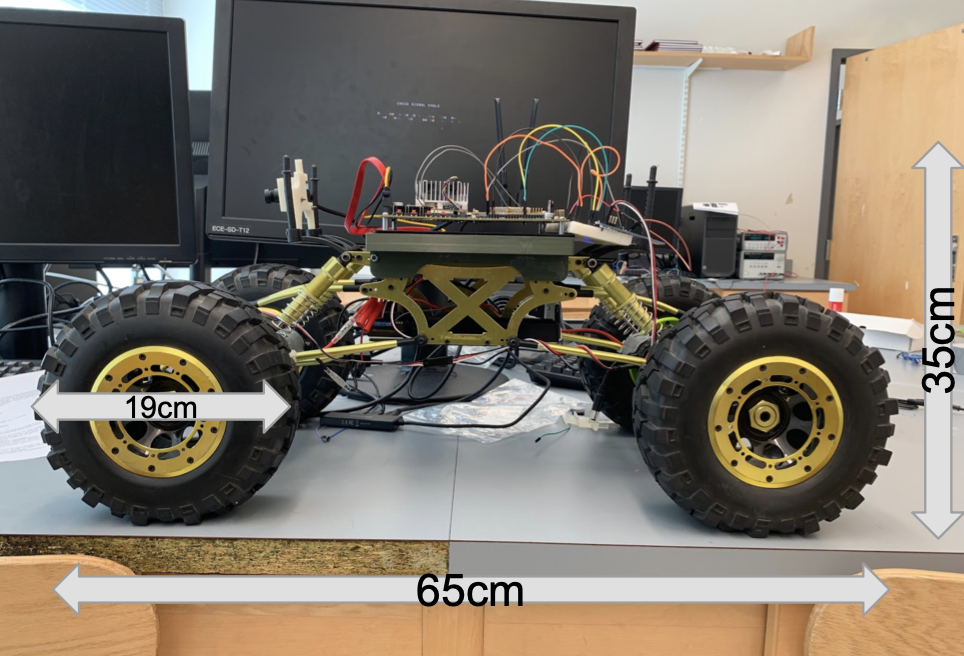

## Project Overview:

Geese can thrive in urban environments because of easy access to food and water with no natural predators. Consequently, there is an overpopulation of geese that has several negative effects on urban life. They feed on grass, increasing the cost of lawn and field maintenance. Moreover, their feces make playing fields and other public areas unpleasant to use.

To combat this problem, my team and I are creating an autonomous robot that identifies and chases geese off of playing fields. Since most fields do not have nearby electric power outlets, the robot will self-dock into a charging station to replenish its battery.

## Requirements:

- The device must include a camera to automatically detect geese covering the distance of a full soccer field (110 yards).
- The device must include a safety mechanism in case of false detection of a goose.
- The device must include a rechargeable battery.
- The device must include self-docking capabilities.
- The device must be able to ward off and intimidate geese, causing them to flee.
- The device must be terrestrial (use of drones is illegal).
- Robot storage space must be able to be moved for cleaning purposes.

## Materials (excluding charging station):
- e-con systems USB 3.0 camera
- Nvidia Jetson TX2
- Vehicle provided by our professor 
- Adafruit 16-Channel 12-bit PWM/Servo Driver (I2C interface - PCA9685)
- GTX1070 (GPU for algorithm training)

## My Role:

I was tasked with training an algorithm to effectively detect geese and integrate it with our camera and motor control code. 

### Algorithm Training:

For the goose-detection algorithm, I trained an open source, neural network called YOLO (You Only Look Once). Specifically, I trained two seperate algorithms: YOLOv3 (53 convolution layers) and TinyYOLOv3 (24 convolution layers). YOLOv3 has more layers so it is typically more accurate but slower than TinyYOLOv3. To avoid annotating thousands of images, I leveraged transfer learning by starting with a model pre-trained on thousands of images from Imagenet and then trained it on the following datsets:

- Set 1: 300 images of geese (218 / 82)
- Set 2: 472 images of geese (315 /157)
- Set 3: 522 images of geese (348 /174) 

The numbers in parentheses refer to the ratio of images used for training to images used for testing in each respective dataset. I used a ratio of roughly 2:1 for all of them (per recommendation of my professor who is an expert in computer vision). The annotated images can be found in the "Annotated Images" folder and corresponding training and testing sets can be found in "Datasets".

### Algorithm Evaluation:

#### Metrics
- Classification Accuracy = (# of geese detected / # of geese in test set) where any detection over a confidence threshold of  0.75 is classified as a goose
- False Positive Percentage = (# of geese detected / # of objects in a dataset not containing geese) 

#### Desired Speed:
- Based on preliminary tests with a raspberry pi, anything faster than 10 FPS is sufficient for our purposes

#### Desired Accuracy: 
- Classification Accuracy of 80% 
- False Positive Tolerance of 5% (meaning given 100 images of people, it will classify less than or equal to 5 people as geese)

Our target classfication accuracy of 80% was chosen somewhat arbitrarily. We felt that it was a realistic target given our time constraints and that an algorithm with that accuracy, although not perfect, would be functional. We explicitly defined a low false positive tolerance in order to prevent a potentially dangerous situation where our robot chases a person. 

### Vision System Performance:

The following is how the vision system performed on the Nvidia Jetson TX2:

#### Speed:
- YOLOv3 - 3 FPS
- TinyYOLOv3 - 20 FPS

#### Current Accuracy:
- YOLOv3 - Didn't test accuracy since algorithm was too slow for our needs
- TinyYOLOv3 - 60% classification accuracy
- False Positive Tolerance remains to be tested

### Analyzing Results:

Above is a graph of accuracy versus different weights tested on Set 2 (or Set_472) and Set 3 (or Set_522) respectively. The "weights" are essentially independent algorithms corresponding to different points in the training process. The highest accuracy of 60% is achieved on Set 3 when weights = 50,000, which is to say that the most accurate algorithm is achieved after 50,000 training iterations through the neural network. In an effort to increase the accuracy of the current algorithm, I plan on re-training it with several different learning rates and eventually creating a bigger dataset. I intend to look closely at the weights corresponding to less than or equal to 50,000 iterations as I suspect the model began to overfit the data afterward.
 
### Integration:

In order to integrate YOLO with the camera and motor control code, I used the Robotics Operating System(ROS). ROS is essentialy a collection of tools that allows executables (or "nodes") to communicate and transfer data. It simplifies the design process since there is no need to combine everything into a monolithic block of code. The YOLO framework is already implemented in a ROS package called "darknet_ros" and a camera node already exists in the "usb_cam" package. Therefore, I only needed to swap the default object detection algorithm with my goose detection algorithm and create one node from scratch for the motor control code. At a high level, the design is simple. The camera node passes frames to the object detection algorithm ("darknet_ros") which subsequently passes the location of geese to the motor control code.

## Project Status:

The vehicle successfully chases images of geese in a lab setting (a link to a video can be found in artifacts). The following are our next steps:

- Write bootup commands so we can test it outside a lab setting (we are currently starting it with a monitor and simply disconnecting the HDMI cable)
- Integrate GPS so the vehicle can stay within the bounds of the field and locate the charging station
- Train the algorithm to detect the charging station so it can self dock
- Test the false positive tolerance of the algorithm

## Artifacts:

The folllowing are images of the final hardware implementation:

  
  
  

The following video demonstrates my teamate and I testing the motor control functionality with an image of a goose:

 - https://drive.google.com/open?id=1HdMxbxYG6SnRhQhuJY8n_OG2iT7D7XsG
 
 Basic functionality in a lab setting:
 
- https://drive.google.com/open?id=1DkieirNAbRpRv0mrybSEIa-UlO9YhPzW

## Resources:
YOLO Object Detector: https://pjreddie.com/darknet/yolo/

Image Annotation Tool: https://github.com/ManivannanMurugavel/YOLO-Annotation-Tool

Darknet-ROS Implementation: https://github.com/leggedrobotics/darknet_ros

YOLO Tutorial: https://medium.com/@manivannan_data/how-to-train-yolov3-to-detect-custom-objects-ccbcafeb13d2

Google Images Download: https://github.com/hardikvasa/google-images-download

usb_cam node: http://wiki.ros.org/usb_cam
